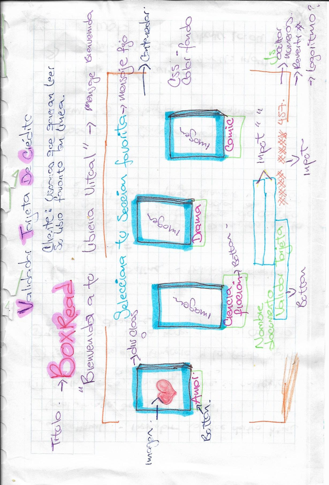
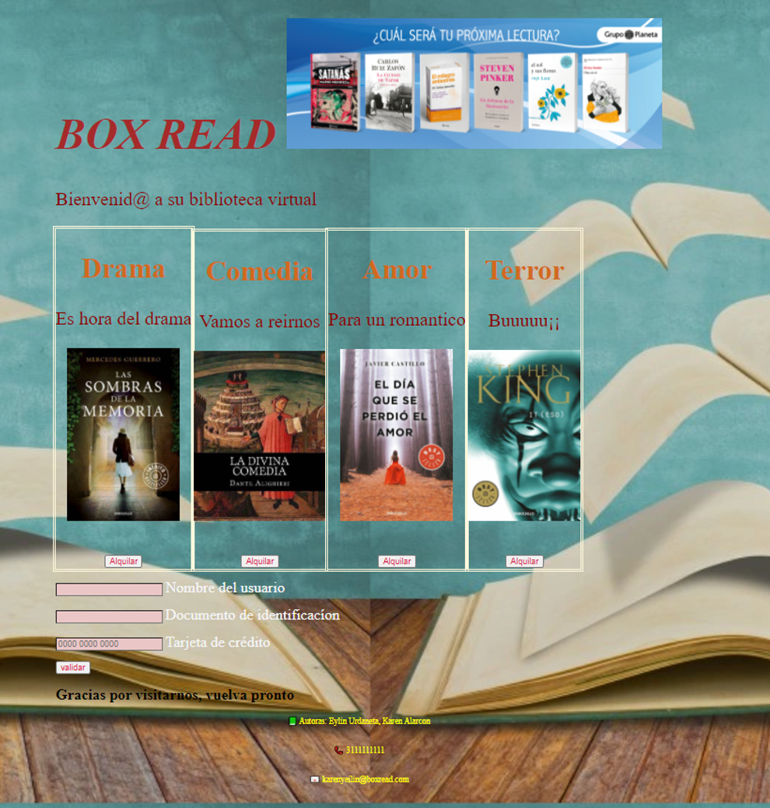

Proyecto: BOX READ
Nuestro proyecto se trata de una libreria virtual, en donde nuestro usuarios tienen la facilidad de alquilar su libro favorito de aucerdo a la seccion, adicionalmente solo pagara por el tiempo que desee tener el libro y no esta obligado a comprarlo.

Investigacion UX

Nuestro proyecto va dirigido a usuarios que tengan pasion por la lectura, y que al mismo tiempo puedan pagar por un libro que puedan leer virtualmente sin la obligacion de comprarlo.

Prototipo Papel

Prototipo Final

Validaciones de la tarjeta de credito

